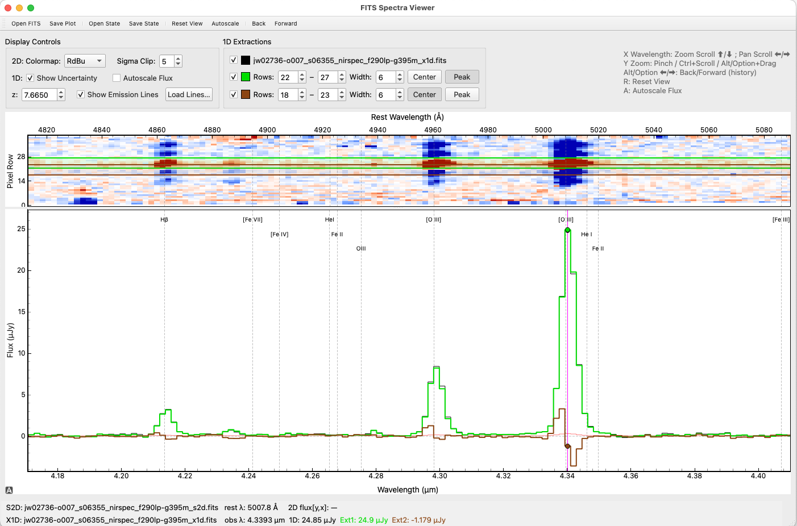

# Spectacle Spectrum Viewer

A lightweight, interactive FITS spectrum viewer built with **PyQt5** and **pyqtgraph**.

Spectacle allows for smooth, intuitive exploration of astronomical spectra. Originally designed for JWST NIRSpec MOS data, it excels at displaying and synchronizing 2D rectified spectra (`s2d.fits`) and 1D extractions (`x1d.fits`). It can also be used as a general-purpose viewer for any 1D FITS spectrum.

What's in your spectra? See it all with Spectacle.

---

<p align="center">
  
</p>

---

## Features

*   **Synchronized 2D/1D Viewing**: Pans and zooms on the wavelength axis are linked between the 2D and 1D plots.
*   **Manual Extractions**: Interactively define, view, and refine multiple 1D boxcar extractions directly on the 2D spectrum.
    *   Helper buttons to automatically find the **Peak** signal or the geometric **Center**.
    *   Customizable colors for each extraction.
*   **Save & Load State**: Save your entire session—including file paths, view ranges, redshift, and extraction settings—to a `.json` file. Restore your session instantly by opening the state file.
*   **Save High-Quality Plots**: Export the current view of the 1D, 2D, or a combined plot to **PNG** or **PDF** formats.
*   **Custom Annotation**: Use an external Python script to add custom annotations (lines, text, markers) to your plots for detailed analysis.
*   **Intuitive Controls**: Navigate your data efficiently with trackpad gestures and keyboard shortcuts.
*   **Emission Line Overlays**: Display common emission lines, automatically shifted by a user-provided redshift. Load your own custom line lists.

---

## Installation

Spectacle requires Python 3 and a few common scientific libraries.

1.  **Required Libraries:**
    ```bash
    pip install PyQt5 pyqtgraph astropy numpy
    ```
2.  **Optional for PDF Export:** To save plots in PDF format, you also need `reportlab`.
    ```bash
    pip install reportlab
    ```

---

## Usage

Run Spectacle from the command line, optionally providing a file to open.

### Command-Line Options
```text
usage: spectacle.py [-h] [-z REDSHIFT] [--lines LINES] [--annotate ANNOTATE] input_file

FITS Spectra Viewer

positional arguments:
  input_file            Path to a FITS file (s2d or x1d) or a .json state file

optional arguments:
  -h, --help            show this help message and exit
  -z REDSHIFT, --redshift REDSHIFT
                        Initial redshift (only used with FITS files)
  --lines LINES         Path to a custom emission lines file (only used with FITS files)
  --annotate ANNOTATE   Path to a Python script with an annotate_plot(viewer) function
```

### Examples
```bash
# Launch the GUI and open a file manually
python spectacle.py

# Open a 2D spectrum (will auto-detect and load the corresponding x1d file)
python spectacle.py jw02736-o007_s06355_nirspec_f290lp-g395m_s2d.fits

# Open a 1D spectrum by itself
python spectacle.py my_1d_spectrum.fits

# Open a spectrum, set initial redshift, and load a custom line list
python spectacle.py file_s2d.fits -z 7.665 --lines my_lines.txt

# Restore a previously saved session
python spectacle.py spectacle_session.json
```

---

## Key Controls & Gestures

| Action                     | Keys / Gesture                                |
| -------------------------- | --------------------------------------------- |
| **Wavelength Zoom (X)**    | Two-finger scroll ⬆/⬇                         |
| **Wavelength Pan (X)**     | Two-finger scroll ⬅/➡                         |
| **Flux/Row Zoom (Y)**      | Pinch / `Ctrl`+Scroll / `Alt`+Drag (`Option`+Drag on Mac) |
| **Pan Plot**               | Click & Drag                                  |
| **Navigation History**     | `Alt`+`⬅` (Back) / `Alt`+`➡` (Forward)        |
| **Reset View**             | `R`                                           |
| **Autoscale Flux**         | `A`                                           |
| **Save Plot**              | `Ctrl`+`P`                                    |
| **Save State**             | `Ctrl`+`S`                                    |

---

## Advanced Features

### Saving & Loading State

You can save your work by pressing `Ctrl`+`S`. This creates a `.json` file that stores:
*   Paths to the `s2d` and `x1d` files.
*   The current zoom and pan ranges for both plots.
*   The redshift and display settings (colormap, sigma clip).
*   The visibility, color, and row selections for all 1D extractions.

To resume your session, simply open the `.json` file with Spectacle.

### Manual Extractions

The "1D Extractions" panel allows you to perform your own simple analysis.
*   **Manual 1**: Defaults to finding the **Peak** signal in the current view when first enabled.
*   **Manual 2**: Defaults to the geometric **Center** of the 2D detector.
*   The `Peak` and `Center` buttons will remain in a "pressed" state until you manually adjust the rows by dragging the region or changing the spin box values. This provides a visual cue for how the region was last set.
*   The start/stop rows are constrained to prevent the region from inverting or collapsing.

### Custom Annotation Scripts

For advanced analysis, you can overlay custom plot elements using the `--annotate` flag. Provide a Python script containing a function `annotate_plot(viewer)`. This function is executed after data is loaded.

**Example `my_annotations.py`:**
```python
import pyqtgraph as pg

def annotate_plot(viewer):
    # 'viewer' is the main application window object.
    # You have full access to its widgets, like viewer.plot_1d.

    # Example 1: Add a custom label to the 1D plot
    text = pg.TextItem("My Custom Label", color='blue', anchor=(0, 1))
    viewer.plot_1d.addItem(text)
    # Position is in data coordinates (index, flux)
    text.setPos(1000, 8e-6)

    # Example 2: Add a dashed vertical line at a specific pixel index
    line_pos_index = 1500
    pen = pg.mkPen('purple', width=2, style=pg.QtCore.Qt.DotLine)
    
    line1d = pg.InfiniteLine(pos=line_pos_index, angle=90, pen=pen)
    viewer.plot_1d.addItem(line1d)

    if viewer.plot_2d.isVisible():
        line2d = pg.InfiniteLine(pos=line_pos_index, angle=90, pen=pen)
        viewer.plot_2d.addItem(line2d)
```
**Usage:**
```bash
python spectacle.py my_spectrum_s2d.fits --annotate my_annotations.py
```

---

## Credits

Developed by Dan Coe, coded by AI for free using:
- **Claude Opus 4.1** via app (3 free uses)
- **Gemini 2.5 Pro** in VSCode
- **ChatGPT-5** via app and Microsoft Copilot at STScI

With thanks to Tom Resseguier (JHU) for introducing me to PyQt!